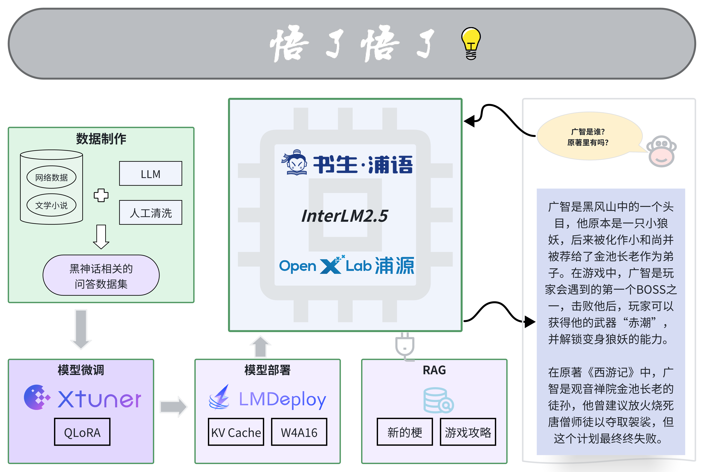

## 前言

国产3A游戏《黑神话：悟空》自发布以来，以其精美绝伦的画面、流畅自如的战斗机制、精心雕琢的设计、深厚的文化底蕴等，在全网引发热潮。开发这款“悟了悟了”AI小助手的初衷，是想帮助玩家深入探索游戏的文化内涵，丰富游戏体验。通过解析游戏中的故事情节、角色渊源、与原著的巧妙联系、游戏隐藏细节以及有趣的彩蛋等内容，让玩家更了解游戏背后的中国传统文化，为玩家在酣畅淋漓的战斗之余，带来一场精神上的盛宴。此外，小助手还提供详尽的游戏攻略，助力玩家轻松通关，尽享游戏乐趣。

悟了悟了AI小助手是基于《黑神话：悟空》、《西游记》、《斗战神》相关资料和大模型生成的问答对，使用书生的InternLM2.5进行QLoRA微调+RAG语料库得到的。

## 框架图

## 版本功能

### 初版

* 游戏角色、背景故事、原著联系等知识问答助手
* 使用RAG支持游戏攻略、菜单、网络梗等新鲜知识的更新
* 基于OpenXLab使用LMDepoly实现初版demo部署

### 进阶版

- 加入语音多模态，如ASR（用户语音输入）、TTS（猴哥语音回答问题）
- 加入图像生成，接入别人的[SD+LoRA模型]( https://www.qpipi.com/73996/ )，判断用户意图生成对应prompt的天命人
- 加入音乐多模态，接类似[SUNO-AI](https://suno-ai.org/)，生成古典风格游戏配乐
- 

## TODO List

### 数据收集

《西游记》原著，《黑神话：悟空》和《斗战神》百科资料等，收集文本资料

收集一些公开的攻略类文章，游戏主站很多（九游、巴哈姆特等游戏网）

### 数据清洗

数据最重要，最难搞了。先清洗和游戏无关的，正则过滤等

利用可联网的LLm和RAG基于公开资料，从生成游戏概述、章节剧情、主要角色、文化内涵等角度生成问题和回答，综合两个模型的回答（如果两个比较接近，则认为大家都是对的，否则不用）作为gt。

攻略类做成向量库用RAG

### 技术方案

#### 底座模型选型

InternLM2.5-chat-7b 或者InterVLM2.5 多模态的也看看

#### Xtuner微调

处理好的问答数据，用XTunner的QLoRA微调

#### RAG框架

参考茴香豆，用LMDeploy 量化部署和Lagent框架试试