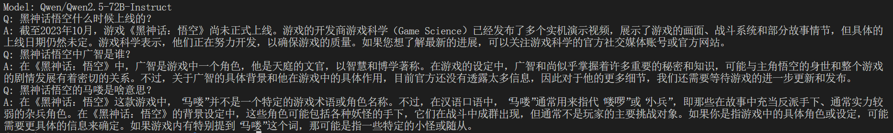

# 悟了悟了数据制作教程


## 一、前言

高质量的数据集是训练和微调模型的关键，数据制作一般会借用一些大模型的API（如InterLM、DeepSeek、Qwen、OpenAI等），可以去对应官网查看或者用第三方的如[硅基流动](https://siliconflow.cn/)（注册会送一定量token，足够用来做数据）等，一般付费的效果更好。

本模型数据制作包含**增量预训练数据和微调数据**两部分，最终格式是适配了Xtuner训练格式的数据：

增量预训练数据是从网络上收集到的和《黑神话：悟空》、《西游记》、《悟空传》等相关的文本数据。

微调数据是用来给模型指令微调的问答对数据，制作难点在于**知识的实时性和准确性**，本模型借助[茴香豆](https://github.com/InternLM/HuixiangDou/tree/main)RAG功能，从收集的文本资料中提取准确的知识信息。


## 二、增量预训练数据

这一部分比较简单，不需要API，对收集到的原始文本数据切分后存为对应格式就行，可以参考 wulewule/data/generate_incremental_pretraining.py 这个脚本。

```
cd wulewule/data
python3 generate_incremental_pretraining.py --root-path ./ --save-path ./incremental_pretraining.jsonl
```

### 实现细节

#### **文本切分**

把原始数据切分成一个个小块给到模型训练（类似RAG中的chunking），使用了langchain中RecursiveCharacterTextSplitter方法对文本字符递归切分，额外增加了一些中文标点用来断句。

默认参数为：chunk-size（每个文本块的大小）为1024，chunk-overlap（相邻两个文本框重叠长度，防止丢失上下文信息）为50。

**最终数据格式**

xtuner 定义的增量预训练数据格式如下，"input"为空就行，文本块放在"output"里，想了解更多细节可以看[xtuner官方增量预训练数据文档](https://github.com/InternLM/xtuner/blob/main/docs/en/user_guides/incremental_pretraining.md):

```
    [
        {
            "conversation":[
                {
                    "input": "",  ## 空的，未使用
                    "output": "xxx" ## 切分后的文本
                },
            ]
        },
        {
            "conversation":[
                {
                    "input": "",
                    "output": "xxx"
                },
            ]
        }
    ]
```

最终保存为jsonl格式，每行是一个字典，对应内容如下：

```
{"conversation": [{"input": "", "output": "《西游记白话文》\n\n\n 第1回 惊天地美猴王出世\n\n    这是一个神话故事，传说在很久很久以前，..."}]}
```


## 三、指令微调数据

普通大模型API只能基于训练时的知识库生成回答，很多知识都停留在过去，比如调用API问“黑神话悟空什么时候发布的”，大多数的都无法给出准确的答案（发布时间2024年08月20日），因为训练资料都是比这个日期之前的。



本模型先使用大模型API生成问题，然后借助[茴香豆](https://github.com/InternLM/HuixiangDou/tree/main)RAG功能，从收集的文本资料中提取对应问题准确的答案（如果本地资料未检索到，则联网检索答案）。

具体实现可以参考 wulewule/data/huixiangdou_rag_QA.py 这个脚本，使用前需要将data_utils.py中的"api_key"换成自己的，同时开启茴香豆server服务

### 实现细节

#### **问题生成**

借用大模型从【 "游戏概述", "章节与故事情节", "主要角色", "人物剧情梳理", "游戏世界观", "建筑与环境", "战斗系统", "游戏玩法", "艺术与音乐", "文化内涵", "市场影响", "彩蛋、网络梗" 】11个角度生成不同的问题：

```python
aspects = [ "游戏概述", "章节与故事情节", "主要角色", "人物剧情梳理", "游戏世界观", "建筑与环境", "战斗系统", "游戏玩法", "艺术与音乐", "文化内涵", "市场影响", "彩蛋、网络梗" ]
question_number = 10
for ascpect in aspects:
    messages=[
        {"role":"system", "content": f"""你是一名提问助手，专注于围绕游戏《黑神话：悟空》的特定方面（例如主要角色、战斗机制或故事情节）提出问题，20个字以内。根据用户的指示，调整你的提问内容，引导玩家深入思考该方面的背景、动机及其在游戏中的作用和发展。不需要序号，最终返回为一个list，格式为['问题', '问题', ...]"""},
        {"role": "user", "content": f"请你就《黑神话：悟空》的‘{ascpect}’方面提出{question_number}个不同的问题，帮助玩家了解游戏在该方面的信息。"},
    ]
    text_res = response(messages, temperature=0.7)
```

messages中就是要给API的数据，基于上述prompt让它成为一个专门生成问题的助手，再从不同方面生成对应问题。

#### **调用模型api**

response函数就是调用API生成回答了，这边使用的是[硅基流动](https://siliconflow.cn/)平台（也可以用其他平台或者本地的模型），[官网有很详细的文档](https://docs.siliconflow.cn/api-reference/chat-completions/chat-completions)，下面是一个使用requests的例子，需要将"<token>" 换成你自己的：

```python
import requests

url = "https://api.siliconflow.cn/v1/chat/completions"

payload = {
    "model": "deepseek-ai/DeepSeek-V2.5",
    "messages": [
        {
            "role": "user",
            "content": "SiliconCloud推出分层速率方案与免费模型RPM提升10倍，对于整个大模型应用领域带来哪些改变？"
        }
    ],
    "stream": False,
    "max_tokens": 512,
    "stop": ["<string>"],
    "temperature": 0.7,
    "top_p": 0.7,
    "top_k": 50,
    "frequency_penalty": 0.5,
    "n": 1,
    "response_format": {"type": "json_object"}
}
headers = {
    "Authorization": "Bearer <token>",
    "Content-Type": "application/json"
}

response = requests.request("POST", url, json=payload, headers=headers)

print(response.text)
```

或者是用OpenAI的方式，api_key换成你自己的

```python
from openai import OpenAI

client = OpenAI(
    base_url='https://api.siliconflow.cn/v1',
    api_key='your-api-key'
)

def response(messages, max_tokens=512, temperature=0.5):
    res = client.chat.completions.create(
        model="deepseek-ai/DeepSeek-V2.5",
        messages=messages,
        max_tokens=max_tokens,
        temperature=temperature,
    ).choices[0].message.content
    return res
```

最终API返回的数据都是string类型，虽然prompt中说明了固定格式，但如果API模型效果没那么好，可能不会按这个格式输出，所以最好用正则处理一下结果，这里用的"deepseek-ai/DeepSeek-V2.5"好像没遇到这种情况。


#### **开启茴香豆RAG服务**

参考实战营-[茴香豆本地标准版搭建](https://github.com/InternLM/Tutorial/tree/camp3/docs/L2/Huixiangdou#2-%E8%8C%B4%E9%A6%99%E8%B1%86%E6%9C%AC%E5%9C%B0%E6%A0%87%E5%87%86%E7%89%88%E6%90%AD%E5%BB%BA)的讲解，进行环境和模型配置即可，不再赘述。

用data目录下的文本数据创建自己的知识库后，开启服务端，监听 23333 端口，使用 `chat_in_group` pipeline：

```
python3 -m huixiangdou.server --pipeline chat_in_group

# cURL 测试状态回调接口
curl -X POST http://127.0.0.1:23333/huixiangdou_stream  -H "Content-Type: application/json" -d '{"text": "how to install mmpose","image": ""}'
# cURL 测试同步接口
curl -X POST http://127.0.0.1:23333/huixiangdou_inference  -H "Content-Type: application/json" -d '{"text": "how to install mmpose","image": ""}'
```

如果需要开启网络检索，当模型本地检索不到结果时进行联网检索，需要注册Serper，参考[开启网络搜索](https://github.com/InternLM/Tutorial/tree/camp3/docs/L2/Huixiangdou#31-%E5%BC%80%E5%90%AF%E7%BD%91%E7%BB%9C%E6%90%9C%E7%B4%A2)

#### **调用RAG生成回答**

将API得到的问题给到茴香豆RAG，然后得到最终答案即可，参考下方函数

```python
def generate_answers(questions="黑神话悟空什么时候发布的",  english=False):
    """
        参考https://github.com/InternLM/HuixiangDou/blob/main/README_zh.md 先开启对应的服务
    """
    # 定义请求的URL
    url = 'http://127.0.0.1:23333/huixiangdou_inference'

    # 定义你要发送的数据
    data = {
        "text": f"{questions}",
        "image": ""
    }

    # 将数据转换成json格式
    payload = json.dumps(data)

    # 设置请求头
    headers = {
        'Content-Type': 'application/json'
    }

    # 发送POST请求
    rag_response = requests.post(url, data=payload, headers=headers)
    # 检查请求是否成功
    if rag_response.status_code != 200:
        logger.error(f"请求失败，状态码：{rag_response.status_code}")

    res_txt = rag_response.text
    res = json.loads(res_txt, strict=False)
    answer = ""
    for step in res["step"]:
        if step["state"] == "success":
            answer = step["response"]
            logger.info(f"got response: {answer}")
    if answer == "":
        logger.error(f'no answer: {res_txt}')
    return answer
```


#### **最终数据格式**

以下时xtuner使用的指令微调数据格式，如果是多轮对话，只需要再第一次对话中加入"system"，最好这个system prompt和你最终使用时给模型的prompt保持一致

```
[{
    "conversation":[
        {
            "system": "xxx",
            "input": "xxx",
            "output": "xxx"
        }
    ]
},
{
    "conversation":[
        {
            "system": "xxx",
            "input": "xxx",
            "output": "xxx"
        },
        {
            "input": "xxx",
            "output": "xxx"
        }
    ]
}]
```

最终保存为jsonl格式，每行是一个字典，以下是一个例子

```python
{"conversation": [{"system": "你是悟了悟了，...", "input": "游戏世界观的设定灵感来源是什么？", "output": "《黑神话：悟空》的游戏世界观深受《西游记》的影响，但在此基础上进行了大胆的创新和扩展。游戏构建了一个佛道衰败、妖魔横行的末法时代背景，其中许多角色和地点都源自《西游记》，如孙悟空、牛魔王、蜘蛛精等，这些角色在游戏世界中被赋予了新的故事和性格。同时，游戏还增加了新的神话元素和角色，如黄眉老祖、黑熊精等，这些新角色的加入丰富了游戏的世界观和剧情。因此，游戏世界观的设定灵感来源主要是《西游记》，但通过创新和扩展，构建了一个既熟悉又新奇的神话世界。"}, {"input": "在《黑神话：悟空》中，孙悟空的棍法技能在不同战斗场景中如何应用？请简要回答", "output": "在《黑神话：悟空》中，孙悟空的棍法技能在不同战斗场景中有着不同的应用方式，以下是简要回答：..."}]}
```

